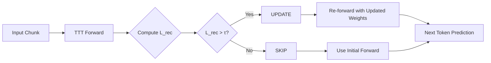

# PonderTTT

> **When to Ponder: Adaptive Compute Allocation for Code Generation via Test-Time Training**

[arXiv Paper](https://arxiv.org/abs/XXXX.XXXXX) | [Project Page](https://ponderttt.worldsw.dev)

Adaptive Test-Time Training (TTT) for code language modeling. Built with JAX/Flax NNX.

## Core Idea: Training-Free Reconstruction Gating

PonderTTT uses the TTT layer's **self-supervised Reconstruction Loss** to decide when to update:

- **Training-free gating**: No learned classifier or auxiliary networks
- **Inference-compatible**: Signal requires no ground-truth labels
- **EMA-based threshold**: Calibrated on unlabeled data, continuously adapted



## Key Results

### Main Results (Python In-Distribution)

| Model | SKIP (Base) | Oracle | Ours | Recovery |
| :--- | :---: | :---: | :---: | :---: |
| **Small (124M)** | 2.324 | 1.935 | **1.977** | 89.2% |
| **Medium (355M)** | 1.909 | 1.653 | **1.697** | 82.8% |
| **Large (774M)** | 2.005 | 1.580 | **1.656** | 82.1% |
| **XL (1.5B)** | 1.875 | 1.518 | **1.576** | 83.8% |

> **Training-free Reconstruction Gating achieves 82–89% Oracle Recovery** while significantly outperforming Random Skip (1–3% lower loss on Python, up to 16% on OOD languages).

### OOD Generalization (XL 1.5B)

| Language | SKIP | Random | Ours | Oracle |
| :--- | :---: | :---: | :---: | :---: |
| JavaScript | 2.85 | 2.12 | **1.84** | 1.57 |
| Java | 3.21 | 2.33 | **1.95** | 1.64 |
| Go | 6.52 | 4.25 | **4.15** | 3.70 |

### Correlation Analysis

| Model | Language | Correlation ($r$) | Oracle Recovery |
| :--- | :--- | :---: | :---: |
| Small (124M) | Python | **+0.84** | 89.2% |
| Medium (355M) | Python | +0.43 | 82.8% |
| Large (774M) | Python | +0.62 | 82.1% |
| XL (1.5B) | Python | +0.61 | 83.8% |
| XL (1.5B) | Java (OOD) | **+0.84** | — |

### Decision Accuracy

| Model | Random Skip | Ours |
| :--- | :---: | :---: |
| Small (124M) | 52.0% | **59.1%** |
| Medium (355M) | 52.2% | **57.5%** |
| Large (774M) | 51.8% | **59.2%** |
| XL (1.5B) | 52.8% | **59.6%** |

~59% decision accuracy vs Oracle (7pp above random, $p < 10^{-10}$, McNemar's test).

## Installation

```bash
# Install uv if you do not have it yet
curl -LsSf https://astral.sh/uv/install.sh | sh

# Install the project (CPU)
uv pip install -e .

# GPU (CUDA 13)
uv pip install -e . --group gpu

# GPU (CUDA 12)
uv pip install -e . --group gpu12

# TPU
uv pip install -e . --group tpu

# Development
uv pip install -e . --group dev
```

## Quick Start

### Reconstruction Gating

```python
# Compute TTT reconstruction loss for gating decision
output = model(input_ids, use_ttt=True)
recon_loss = output["ttt_stats"]["ttt_loss_step_0"]

# Gating decision (threshold calibrated via EMA)
if recon_loss > threshold:
    # Perform TTT update
    pass
else:
    # Skip update, use current weights
    pass
```

### Reproduce Paper Results

```bash
chmod +x scripts/run_all_experiments.sh

# Run all experiments
./scripts/run_all_experiments.sh

# Run specific model scales
./scripts/run_all_experiments.sh --small    # Small (124M)
./scripts/run_all_experiments.sh --medium   # Medium (355M)
./scripts/run_all_experiments.sh --large    # Large (774M)
./scripts/run_all_experiments.sh --xl       # XL (1.5B)
```

## Supported Models

| Model | Parameters | Status |
| :--- | :---: | :--- |
| GPT-2 Small | 124M | ✅ Validated |
| GPT-2 Medium | 355M | ✅ Validated |
| GPT-2 Large | 774M | ✅ Validated |
| GPT-2 XL | 1.5B | ✅ Validated |
| Gemma 3 4B | 4B | Planned (v2) |
| Gemma 3 12B | 12B | Planned (v2) |

## Repository Structure

```text
ponderttt/
└── src/ponderttt/
    ├── models/
    │   ├── gpt2_nnx.py          # GPT-2 implementation
    │   ├── ttt_layer_nnx.py     # TTT layer
    │   └── gemma3/              # Gemma 3 (v2)
    ├── scripts/
    │   ├── train_baseline.py    # TTT layer training
    │   ├── compare_methods.py   # Gating method comparison
    │   └── run_all_experiments.sh
    └── data/
        └── dataset.py           # Streaming data pipeline
```

## Citation

```bibtex
@article{sim2025ponderttt,
  title={When to Ponder: Adaptive Compute Allocation for Code Generation via Test-Time Training},
  author={Sim, Gihyeon},
  year={2025}
}
```

## License

MIT License
