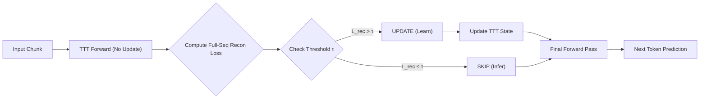

# PonderTTT

[Preprint on Web](https://ponderttt.worldsw.dev)

Adaptive, budget-aware Test-Time Training (TTT) for code generation models built with JAX/Flax NNX.

## Core Idea: Self-Supervised Adaptive Gating

PonderTTT introduces **Adaptive Test-Time Training (TTT)** with a fully self-supervised gating mechanism:

**TTT Reconstruction Loss** → Decides whether to update or skip.

This is **inference-compatible** because the gating signal (reconstruction loss) does not require ground-truth labels.



### How It Works

1. **Compute Full-Sequence Reconstruction Loss** $\mathcal{L}_{rec}$ for each input chunk (self-supervised).
2. **Gate Decision**: If $\mathcal{L}_{rec} > \tau$, perform TTT update. Otherwise, skip.
3. **Full-Seq Signal** (`ttt_loss_init`): Averages reconstruction loss across all positions in the chunk,
   providing stronger correlation with Oracle advantage than last-token-only loss.

### Verified Results

**Configuration**: 50% Update Budget, 1 Gradient Step per chunk.

| Model | Language | Baseline (SKIP) | Oracle | **Recon Gating** | **Oracle Recovery** |
| :--- | :--- | :--- | :--- | :--- | :--- |
| **125M** | Python | 2.332 | 1.950 | **1.990** | **89.5%** |
| **125M** | JavaScript | 2.640 | 2.119 | **2.158** | **92.5%** |
| **125M** | Java | 3.042 | 2.221 | **2.287** | **91.9%** |
| **125M** | Go | 7.944 | 4.832 | **5.047** | **93.1%** |
| **XL** | Python | 1.875 | 1.615 | **1.622** | **97.3%** |
| **XL** | JavaScript | 2.852 | 2.114 | **2.138** | **96.7%** |
| **XL** | Java | 3.213 | 2.268 | **2.292** | **97.5%** |
| **XL** | Go | 6.520 | 4.223 | **4.275** | **97.7%** |

> **Note**: Full-Sequence Reconstruction Gating achieves **89-97% Oracle recovery**, with larger models (XL) showing higher recovery rates (>97%).

### Correlation: Full-Sequence Reconstruction Loss vs Oracle Advantage

| Model | Language | **Pearson r** | Oracle Recovery |
| :--- | :--- | :--- | :--- |
| **125M** | Python | **0.67** | 89.5% |
| **XL** | Python | **0.76** | 97.3% |
| **XL** | JavaScript (OOD) | **0.84** | 96.7% |
| **XL** | Java (OOD) | **0.90** | 97.5% |
| **XL** | Go (OOD) | **0.75** | 97.7% |

> **Finding**: Gating signal reliability **improves with model scale**. XL models show strong correlation ($r \ge 0.75$) and recover >97% of Oracle performance.

## Technical Architecture

Pure JAX/Flax NNX implementation with multi-scale model support.

### Supported Models

| Model | Parameters | Status |
|-------|------------|--------|
| GPT-2 125M | 125M | ✅ Validated |
| GPT-2 350M | 350M | ✅ Validated |
| GPT-2 Large | 774M | ✅ Validated |
| GPT-2 XL | 1.5B | ✅ Validated |
| Gemma 3 1B | 1B | In Progress |
| Gemma 3 4B | 4B | In Progress |
| Gemma 3 12B | 12B | In Progress (TPU) |

### Components

- **Base Model**: Pretrained backbone with frozen weights
- **TTT Layer**: Fast-weight adapter with self-supervised updates
- **Gating**: Training-free, self-supervised
  - **Reconstruction Gating**: Update when $\mathcal{L}_{rec} > \tau$
  - Budget-aware threshold adjustment
  - Prediction entropy / Token confidence (Secondary signals)

### Loss Function

$$L_{total} = L_{CE} + \beta \cdot L_{TTT}$$

- $L_{CE}$: Main task cross-entropy (next-token prediction)
- $L_{TTT}$: TTT reconstruction loss (self-supervised adaptation signal, **also used for gating**)

## Installation

```bash
# Install uv if you do not have it yet
curl -LsSf https://astral.sh/uv/install.sh | sh

# Install the project (CPU)
uv pip install -e .

# GPU (CUDA 13)
uv pip install -e . --group gpu

# GPU (CUDA 12)
uv pip install -e . --group gpu12

# TPU
uv pip install -e . --group tpu

# Development
uv pip install -e . --group dev
```

## Quick Start

### Reconstruction Gating (Inference-Compatible)

```python
# During inference, compute TTT reconstruction loss BEFORE deciding to update
output = model(input_ids, use_ttt=True)
recon_loss = output["ttt_stats"]["ttt_loss_step_0"]

# Gating decision (threshold calibrated from validation set)
if recon_loss > threshold:  # For 125M
    # Perform TTT update
    pass
else:
    # Skip update, use current weights
    pass

# Gating decision based on reconstruction loss threshold
```

### Reproduce Paper Results

```bash
chmod +x scripts/run_all_experiments.sh

# Run all experiments (125M + 350M)
./scripts/run_all_experiments.sh

# Run specific model scales
./scripts/run_all_experiments.sh --125m          # 125M only
./scripts/run_all_experiments.sh --350m          # 350M only
./scripts/run_all_experiments.sh --1b            # GPT-2 Large (774M)
./scripts/run_all_experiments.sh --xl            # GPT-2 XL (1.5B)

# Run specific phases
./scripts/run_all_experiments.sh --125m phase1   # Training only
./scripts/run_all_experiments.sh --350m phase2   # Evaluation only

# Advanced options
./scripts/run_all_experiments.sh --1b phase2 --ttt_base_lr=0.1  # Custom learning rate
```

### Gemma 3 (TPU)

```python
from ponderttt.models.gemma3 import (
    Gemma3Config,
    Gemma3TTTModel,
    load_gemma3_from_huggingface,
    create_device_mesh,
    ShardingConfig,
)

# Initialize
config = Gemma3Config.gemma3_4b()
model = Gemma3TTTModel(config, ttt_config, rngs=rngs)

# Load pretrained weights
model = load_gemma3_from_huggingface(model, "google/gemma-3-4b-pt")

# Setup TPU sharding
mesh = create_device_mesh(ShardingConfig())
```

## Project Status

### Phase 1: Complete (Preprint)

- Pure NNX GPT-2, TTT Layer implementation
- Self-supervised Reconstruction Gating
- Results on GPT-2 (125M, 350M, Large, XL) with OOD evaluation
- Finding: Reconstruction gating provides marginal improvement over random selection

### Phase 2: In Progress

| Component | Status |
|-----------|--------|
| Reconstruction Gating | ✅ Complete |
| Budget-aware Threshold | In Progress |
| Learned Gating Signals | In Progress |
| Gemma 3 Integration | In Progress |
| TPU Pod Sharding | In Progress |
| LoRA-TTT | Planned |
| Reasoning Benchmarks | Planned |

## Repository Structure

```
ponderttt/
└── src/ponderttt/
    ├── models/
    │   ├── gpt2_nnx.py          # GPT-2 implementation
    │   ├── ttt_layer_nnx.py     # TTT layer
    │   └── gemma3/              # Gemma 3 (1B, 4B, 12B, 27B)
    │       ├── model.py         # Gemma3Model, Gemma3TTTModel
    │       ├── config.py        # Model configurations
    │       ├── checkpoint.py    # Weight loading
    │       └── sharding.py      # TPU Pod sharding
    ├── experiments/
    │   ├── train_baseline.py    # TTT baseline training
    │   ├── compare_methods.py   # Gating method comparison
    │   └── analyze_signals.py   # Signal correlation analysis
    └── data/
        └── dataset.py           # Streaming data pipeline
```

## Citation

```bibtex
@article{sim2025ponderttt,
  title={Learning to Ponder: Adaptive Compute Allocation via Test-Time Training},
  author={Sim, Gihyeon},
  year={2025}
}
```

## License

MIT License
